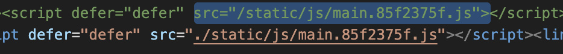

# Seen doing these exercise

## Installation
- `npx create-react-app <project-name>`

## Component props
`props` are what a component child receive from its parent ( the component
that invoked it ).
In order to initiate a child component to be aware of the parent's data passed down,
such as object inheritance concerns, we need to tell the extended React.Component to subscribe to the props received from the parent.

```jsx
// initials a class based component with props
class MyComponent extends Component
	constructor(props){
		// assign inherited props to this component
		super(props)
	}
	render(){
		return(
			<JSX>
		)
	}
```


## State and update
- `this.state` representing the state of a component that 
need to be declared within the class based component constructor.
Note: a component with state is a stateful component ( a commenting with the state logic )

```jsx
// initial state in class based component
class MyComponent extends Component
	constructor(){
		this.state = {
			<property>: <value>
		}
	}
	render(){
		return(
			<JSX>
		)
	}
```

```jsx
// update a class bases component state () - 
this.setState({
	// (optional) update the entire state by restoring the previous state
	...this.state, 

	// updates the concerned property
	<property>: <value>
})
```

### Hosting inner project react
- at the react project level
	- src/public/index.html {PUBLIC_PATH} should be a relative path
	- then run `npm run build`
	- then in the `build/index.html` put relative path by
	 prepending `.` before the path separator
	 